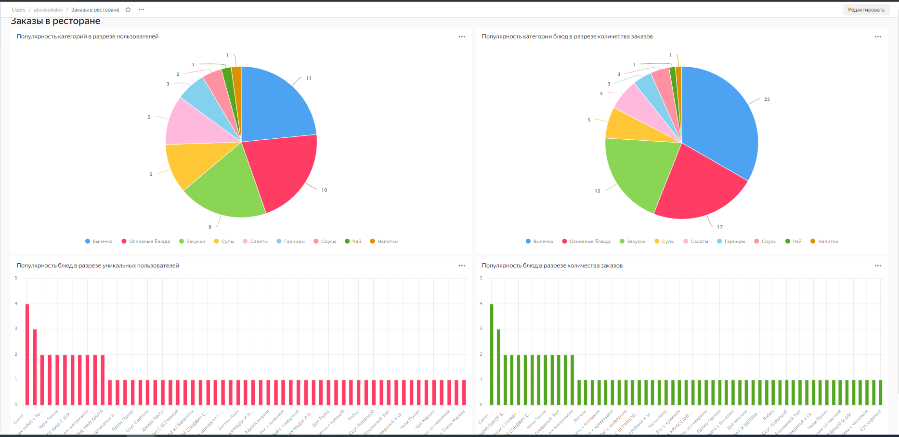

# Проект 9-го спринта

## Описание проекта

Создание микросервисов для обновления данных в слоя DDS, CDM для аналитики заказов в ресторанах в режиме stream.

### Ссылки на container registry
1. DDS - cr.yandex/crpudugt57ek6svcjusc/dds-service
2. CDM - cr.yandex/crpudugt57ek6svcjusc/cdm-service

## Ссылка на datalens
https://datalens.yandex.ru/mpkm4b1v8g0wc-zakazy-v-restorane

Если не откроется (но доступы выданы), то скрин, как выглядит дашборд:

